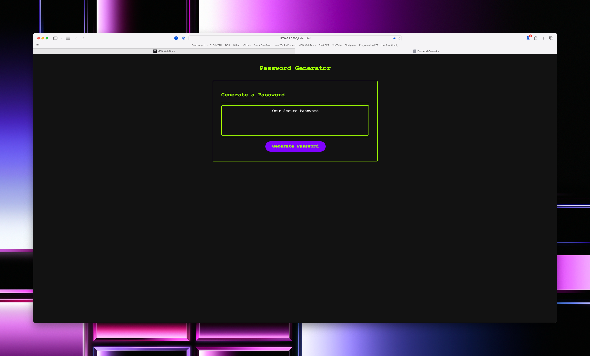

# Password Generator

This repository contains a simple and interactive password generator web application. It helps users create strong, random passwords according to customizable options. 

## Features

1. **Customizable password length:** The user can specify the length of the password, choosing a value between 8 and 128 characters.

2. **Customizable character types:** The user can choose to include any combination of the following character types in their password:
   - Lowercase letters
   - Uppercase letters
   - Numbers
   - Special characters (e.g., `!@#$%^&*()-_=+{}[]|:;,<>.?/`)

3. **Interactive user interface:** The application prompts the user to select their password preferences, and it displays the generated password in a text area on the webpage.

## Usage

To use this password generator, simply load the webpage, click the "Generate Password" button, and follow the prompts to customize your password.

After the password is generated, it will appear in the text area. You can then copy the password and use it wherever you need a strong, random password.

## Technologies Used

- HTML5
- CSS3
- JavaScript
- jQuery

## Possible Future Updates

- **jQuery dialog boxes:** Improve the user interface by switching from JavaScript prompts and confirm dialog boxes to more user-friendly and aesthetically pleasing jQuery dialog boxes.
- **Password strength estimator:** An algorithm to estimate and display the strength of the generated password, based on length and character types used.
- **Copy Password Button** A button that saves the generated password to your clipboard.

## Link to Deployed Application
https://danielrgudmundsen.github.io/CyberCypher/